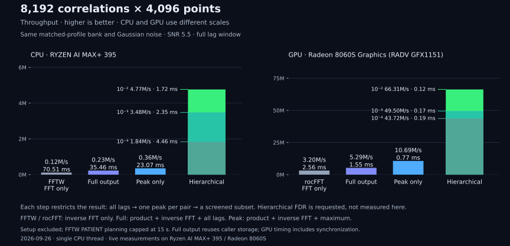

# matchedfilter

Batched correlation with a choice of full or peak-only output, on CPU or GPU.

`matchedfilter` correlates data segments against a template bank and returns
the full complex correlation or the strongest sample in each output bin. It
accepts `complex64` spectra or time-series blocks through `run_series()`.

[Documentation](https://ahnitz.github.io/matchedfilter/) ·
[Usage guide](https://ahnitz.github.io/matchedfilter/using-it.html) ·
[Benchmarks](https://ahnitz.github.io/matchedfilter/benchmarks.html)

**Alpha software:** the API may change. Pin a version for reproducible work.

## Quick start

```bash
pip install matchedfilter
```

This example finds a template shifted by 37 samples:

```python
import numpy as np
import matchedfilter as mf

n = 1024
rng = np.random.default_rng(1)
template = rng.standard_normal(n)
data = np.roll(template, 37)

filt = mf.MatchedFilter(n, ndata=1, ntemplates=1)
filt.set_templates(np.fft.fft(template).astype(np.complex64)[None, :])
filt.set_data(np.fft.fft(data).astype(np.complex64)[None, :])
peaks = filt.run(binsize=n)
print(peaks["index"][0, 0, 0])  # 37
```

The result has shape `(ndata, ntemplates, nbins)`, with `index` and `value`
fields. `value` is complex; use `abs(value)` for its magnitude. Bins below
the detection threshold have `index == -1` and `value == 0`. Results may
reuse storage: copy any result you need to retain across calls.

See the [usage guide](https://ahnitz.github.io/matchedfilter/using-it.html)
for normalization, thresholds, search windows and time-series input.

Use `CorrelationFilter` when downstream code needs every lag:

```python
full = mf.CorrelationFilter(n, ndata=1, ntemplates=1)
full.set_templates(np.fft.fft(template).astype(np.complex64)[None, :])
full.set_data(np.fft.fft(data).astype(np.complex64)[None, :])
correlation = full.run()  # complex64, shape (1, 1, n); peak at lag 37
```

It uses the same spectral inputs, bank dimensions, selectors and device choice
as `MatchedFilter`. The full-output mode keeps the fused spectral product and
batched transforms, but writes all lags. Peak-only filtering avoids those
stores; hierarchical filtering also avoids full transforms for pairs dismissed
by its coarse gate.

## Supported capabilities

| | CPU | GPU |
|---|---|---|
| Peak-only transform sizes | powers of two, 64–1,048,576 | powers of two, 64–65,536; device limits apply |
| Full-output transform sizes | powers of two, 1,024–4,194,304 | powers of two, 1,024–4,194,304; device limits apply |
| Flat and hierarchical filtering | yes | yes |
| Time-series input with `run_series()` | yes | yes |
| Input spectra and returned values | `complex64` | `complex64` |
| Execution | one CPU thread | Vulkan or Metal |

Flat filtering and refinement use single precision. GPU hierarchical
screening can use reduced-precision kernels. There is no float64 filtering API.

The default device is CPU unless `MF_DEVICE` is set. Select a GPU explicitly:

```python
print(mf.devices())
gpu_filter = mf.MatchedFilter(4096, device="gpu")
```

Linux and Windows use Vulkan; macOS uses Metal. A compatible driver is
required. Unsupported GPU requests raise an error. See the
[usage guide](https://ahnitz.github.io/matchedfilter/using-it.html)
for platform and device limits.

## Hierarchical filtering

`HierarchicalFilter` screens each pair using a low-frequency band, then runs
the full filter on candidates. It is useful when most pairs can be dismissed
and enough signal power lies in that band. Otherwise the screening stage can
add work without a useful saving.

Automatic selection uses your expected output-power spectrum and measured
calibration files. `snr` specifies the signal strength and `fd` the requested
false-dismissal budget for that calibration. Validate the calibration against
your template population before relying on it.

For example, with spectra and an output-power reference prepared as described
in the usage guide:

```python
hf = mf.HierarchicalFilter(4096, ndata=16, ntemplates=64, snr=5.5, fd=1e-2)
hf.set_reference(expected_output_power)
hf.set_templates(template_spectra)
hf.set_data(data_spectra)
peaks = hf.run(binsize=4096, threshold=5.5)
```

The coarse gate is computed from the full reference profile and requested
false-dismissal budget; measured cost files select the band. Alternatively,
set an explicit band and coarse threshold. See the [gate model](docs/gate-model.md)
for profile assumptions, sampling precision and validation.

## Performance

The implementation fuses the frequency-domain product into the inverse
transform. Full-output mode writes every lag; peak-only mode scans inside
the transform and avoids those writes. Hierarchical mode screens pairs before
the full transform. Performance depends on length, bank shape, device and the
fraction of pairs requiring refinement.



Measured on a Ryzen AI MAX+ 395 / Radeon 8060S, 2026-09-26: 16 data segments ×
512 templates, 4,096 points. The bars move from a general inverse FFT to
fused full output, peak-only output and hierarchical screening. FFTW and
rocFFT time only the inverse transform, so they do less work than the filter
bars. Full output reuses a caller-supplied result array; GPU timings include
synchronization. Hierarchical bars show requested FDR budgets 1e-2, 1e-3 and
1e-4; these noise-only timings do not measure FDR. The two panels use separate
scales; compare their printed values. This is a workload example, not a speed
guarantee.

The [flat](https://ahnitz.github.io/matchedfilter/benchmarks.html) and
[hierarchical](https://ahnitz.github.io/matchedfilter/hierarchical-benchmarks.html)
benchmark pages show results across available transform sizes.

## Run the benchmarks

```bash
python -m pip install pyfftw  # optional FFTW reference
python -m matchedfilter.benchmark --reps 7 --json bench.json
```

The default sweep covers all 15 CPU sizes, with GPU timings where supported.
Batch sizes shrink at large lengths to bound memory use. `--n` selects a subset.
Missing hierarchical calibration is reported explicitly.

To measure warm overlap-save calls, including automatic peak output at
2,048–8,192 points and continuous full output at 32,768 points, run
`python tools/bench_series_workloads.py`. It checks the output before timing
and compares automatic layout with explicit blocks. Use `--quick` for a
shorter continuous series; CI records that version on each benchmark host.

Install `mkl-fft` and `mkl` for an optional MKL reference where supported.
NumPy provides the correctness reference. Without FFTW or MKL, library timings
and correctness checks still run. Reference timing covers the inverse FFT;
matchedfilter timing also includes the product and peak scan.

## Documentation

- [Usage guide](https://ahnitz.github.io/matchedfilter/using-it.html): inputs, normalization, devices and API behavior.
- [Examples](https://ahnitz.github.io/matchedfilter/demo.html): noise and injected signals.
- [Numerical accuracy](https://ahnitz.github.io/matchedfilter/precision.html): comparison with a float64 reference.
- [Design notes](https://ahnitz.github.io/matchedfilter/notes.html): implementation details and historical experiments.

## Status

This is an alpha release. Pin a version when reproducibility matters.
Hierarchical calibration covers a subset of input conditions; unsupported
requests require additional measurements or explicit coarse parameters.

Wheels target CPython 3.10–3.14 on Linux x86-64 and macOS arm64. Other platforms
build from source and need NumPy and a C compiler. CPU filtering uses one
thread; callers control parallelism across independent filters.

## Contributing

[Issues](https://github.com/ahnitz/matchedfilter/issues/new) and pull requests
are welcome. Useful contributions include device-specific benchmarks,
calibration measurements and testing on additional hardware.

```bash
git clone https://github.com/ahnitz/matchedfilter
cd matchedfilter
git submodule update --init third_party/highway
pip install -e .
pytest
```

GPU kernels are written in Slang. Rebuild the shipped SPIR-V and Metal sources
with `python tools/build_spirv.py --slangc /path/to/slangc`.

## License

MIT
