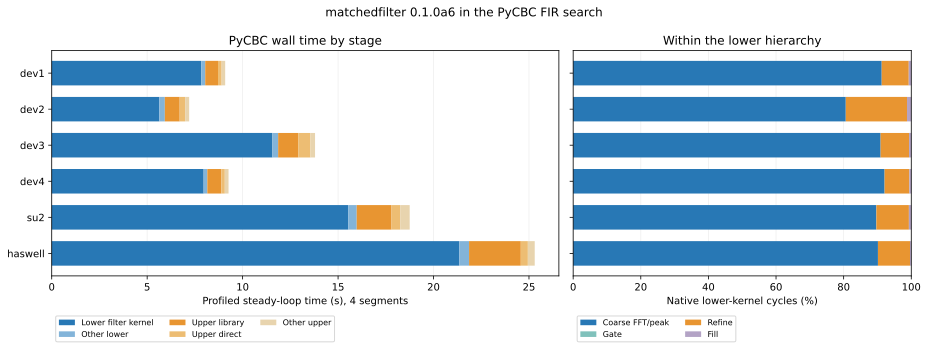

# PyCBC FIR search on matchedfilter 0.1.0a6

Measured September 27, 2026 on the six requested Linux hosts. These are
**single-core CPU** measurements of the complete ratio-enabled PyCBC search,
using the wider three-level bank. The tagged library is `v0.1.0a6`
(`c9f9d4d`); each host imported version `0.1.0a6` from an isolated benchmark
installation. Dev1–4 used the Python 3.13 wheel; sugwg-login2 and Haswell
built the source archive for Python 3.11. The original installations were
left in place.



Three clean searches per host used one pinned logical CPU. The rate divides
8,848,032 template-seconds by the four steady segments' lower plus upper
search time. The first segment, startup, bank preparation, and final HDF write
are excluded. The cost columns come from a **separate instrumented search**;
they should not be added to the clean median time. The native percentages
partition cycles inside the lower hierarchical kernel.

| Host | CPU | Clean median (s) | Rate (k template-s/s/core) | Three-run range (k) | Profiled lower kernel / upper (s) | Coarse / refine of lower kernel |
|---|---|---:|---:|---:|---:|---:|
| dev1 | Ryzen 9 5950X, AVX2 | 8.90 | 994 | 994–995 | 7.84 / 1.04 | 91.3% / 8.0% |
| dev2 | Ryzen AI Max+ 395, AVX3 | 7.96 | 1,112 | 1,071–1,254 | 5.63 / 1.27 | 80.6% / 18.1% |
| dev3 | Ryzen 5 5500U, AVX2 | 13.58 | 652 | 651–652 | 11.56 / 1.93 | 90.9% / 8.4% |
| dev4 | Core i5-13500H, AVX2 | 9.19 | 963 | 961–966 | 7.96 / 1.11 | 92.1% / 7.3% |
| sugwg-login2 | Xeon Platinum 8260 guest, AVX3 | 18.52 | 478 | 476–480 | 15.54 / 2.77 | 89.7% / 9.6% |
| og-node-169 | Xeon E5-2698 v3 Haswell, AVX2 | 24.97 | 354 | 352–355 | 21.35 / 3.44 | 90.1% / 9.5% |

The instrumented run's wall-time components, in seconds:

| Host | Lower library kernel | Other lower | Upper library | Upper direct reference | Other upper | Total |
|---|---:|---:|---:|---:|---:|---:|
| dev1 | 7.84 | 0.21 | 0.67 | 0.19 | 0.19 | 9.09 |
| dev2 | 5.63 | 0.29 | 0.78 | 0.29 | 0.21 | 7.20 |
| dev3 | 11.56 | 0.30 | 1.05 | 0.64 | 0.24 | 13.79 |
| dev4 | 7.96 | 0.19 | 0.74 | 0.18 | 0.20 | 9.26 |
| sugwg-login2 | 15.54 | 0.44 | 1.82 | 0.46 | 0.50 | 18.75 |
| og-node-169 | 21.35 | 0.51 | 2.71 | 0.37 | 0.36 | 25.30 |

The profiled lower kernel accounts for **78–86%** of the measured steady loop.
Its coarse pass accounts for **81–92% of native kernel cycles**. Dev2's
refinement share is 18%, about twice the other hosts, even though the same
bank, threshold, and trigger set were used. On Haswell, the clean median is
354k template-seconds/s/core, consistent with the preceding alpha-6 acceptance
run near 349k. The sugwg-login2 CPU is a virtualized guest. Dev2's 1,071–1,254k
spread is visibly noisier than the other hosts, so its median is a snapshot of
shared-host conditions.

## Interpretation and next work

The lower hierarchical library call is the primary target on every CPU. In
absolute terms, Haswell spends 21.35 of 25.30 profiled steady seconds there;
sugwg-login2 spends 15.54 of 18.75. The upper library filter is next, at
roughly 7–11% of the loop; upper direct reference and scaling are smaller.
Optimizing bookkeeping around the lower call cannot remove more than its
0.19–0.51 second "other lower" slice on these hosts.

Inside the lower kernel, coarse transforms and their peak reduction take
about 90% of cycles on five hosts. An improvement there has broad leverage.
Dev2 is different: its AVX3 coarse path is faster relative to refinement,
making refinement 18.1% of native cycles. A refinement change should be
measured on dev2 as well as Haswell before generalizing it. These percentages
are cycle shares from instrumented code; they do not imply equal wall-time
fractions under different CPU clocks or across hosts.

The next agent can measure the hardware GPU path on dev2 (Radeon 8060S),
dev3 (Radeon Renoir), and dev4 (Iris Xe) as a **separate PyCBC experiment**.
The PyCBC ratio filter accepts `PYCBC_RATIO_DEVICE=gpu`, and the tagged
library discovers those devices. A full GPU search must include the repeated
host transfers and dispatches that the library's isolated GPU benchmark
excludes. Keep the same bank, false-dismissal target, SNR threshold, trigger
identity check, and steady-segment denominator. Dev1 exposes only a software
Vulkan renderer; sugwg-login2 and Haswell expose no hardware GPU.

All searches used the same 5,883-template bank, FFTW, false-dismissal target
0.001, SNR threshold 5.5, and GPS interval 1000000000–1000002000. The bank
SHA-256 is `1fcf1cb050adea4fb8d85c4153f36d7dd6f7ba4782f41f1d452540fa8b43bbcf`.
The denominator is 4 segments × 5,883 templates × 376 analyzed seconds.
CPU affinity was 0 on dev1/dev3/dev4/sugwg-login2, 2 on dev2, and 3 on
Haswell. PyCBC's apogee search code was the ratio-enabled `a2d64b76` source
or its copied benchmark tree. Dev2's source launcher was used explicitly;
its older virtualenv launcher omitted upper-stage timing and those discarded
runs are absent from the table.

Each host produced **4,386 triggers with identical template hashes and end
times**. The Haswell output also matches the original PyCBC baseline in those
fields; its SNR field matches exactly. The profiling runs report 6,519,377
lower pair-calls and 143,876 filter blocks across the steady segments, with
band 1024 and eight taps for all 68 lower groups. `MF_HMF_PROF` counts cycles
in the coarse pass, gate, refinement, and rejected-output fill. Its gate
counter covers a narrow verdict section; work fused into the coarse FFT/peak
pass is charged to that pass. Percentages use differences of cumulative
per-plan cycle counters between segments 0 and 4, weighted by pair counts.

The chart's left side uses one profiled search per host: lower kernel, other
lower work, upper matchedfilter library call, upper direct reference, and
remaining upper work. Profiling changes timings, so the clean medians above
are the performance comparison. GPU searches were outside this CPU workload;
dev2–4 do expose hardware GPUs and need a separate end-to-end GPU comparison.

[Machine-readable summaries](results.json), [the chart](chart.svg),
[compressed raw logs](logs.tar.gz), and [analysis script](analyze.py) are
together in this folder. Extract the logs into a directory with one
subdirectory per host, then run:

```bash
tar -xzf docs/measurements/pycbc-alpha6-fleet-20260927/logs.tar.gz -C LOG_ROOT
python docs/measurements/pycbc-alpha6-fleet-20260927/analyze.py LOG_ROOT \
  --json docs/measurements/pycbc-alpha6-fleet-20260927/results.json \
  --chart docs/measurements/pycbc-alpha6-fleet-20260927/chart.svg
```

`analyze.py` requires NumPy and Matplotlib only for plotting; it parses
PyCBC logs with the standard library. The compressed logs hold three clean
repeats and one profiled run per host. Dev2 files use `source-clean-*` because
the first attempt accidentally invoked an older virtualenv launcher that
omitted upper-stage timing. Those discarded runs are not archived here.
