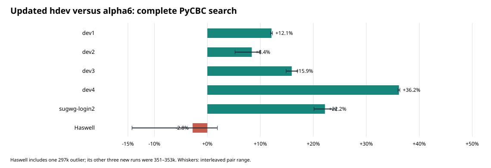
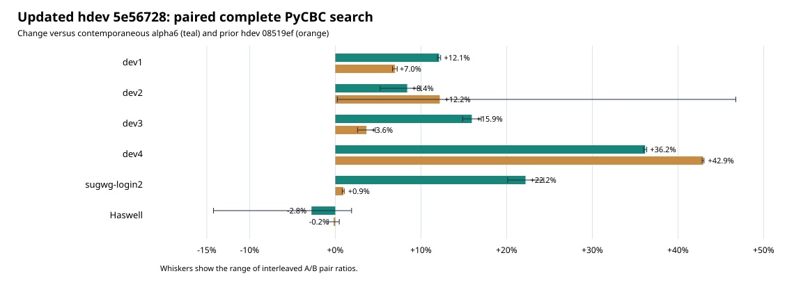

# Updated `hdev` PyCBC fleet benchmark, 2026-09-27

This handoff measures the new `hdev` head
`5e56728785ea0f447edcf3a37a56f4d3263f4543` against alpha6 and the
previous `hdev` head `08519ef211c426e5e2e1c69f336153933252ac26`.
The branch did not change during measurement. The new commit changes the
AVX2 coarse filter: peak accumulation, loop unrolling, and pair-batch
selection. The source branch was not merged for this benchmark.

| CPU host | Alpha6 k template-s/s | New `hdev` k template-s/s | Change vs alpha6 | Change vs old `hdev` | New lower-stage k template-s/s |
|---|---:|---:|---:|---:|---:|
| dev1 | 989.9 | 1109.8 | +12.1% | +7.0% | 1279.9 |
| dev2 | 1306.6 | 1416.3 | +8.4% | +12.2% | 1931.6 |
| dev3 | 652.5 | 756.5 | +15.9% | +3.6% | 905.1 |
| dev4 | 963.1 | 1311.4 | **+36.2%** | **+42.9%** | 1569.8 |
| sugwg-login2 | 479.9 | 586.5 | +22.2% | +0.9% | 722.5 |
| og-node-169, Haswell | 345.8 | 336.1 | −2.8% mean | −0.2% | 392.4 mean |

The direct old-versus-new percentages come from a second, contemporaneous
paired run on every host. They should be used instead of comparing the new
rates to those in the previous day's handoff: shared-host load changed,
especially on dev2 and sugwg-login2.

The largest new gain is dev4. Its old `hdev` head was 5% below alpha6;
the updated head is now 36% above alpha6. Login2's strong ~22% advantage
over alpha6 remains, but this update adds little there. Haswell **still
does not have the requested large improvement**. Three of four new-build
searches ran at 351–353k, roughly 1–2% above alpha6's 345–347k. One ran
at 297k, pulling the four-run mean to 336k. The direct old-versus-new
searches were essentially flat (354.5k old, 353.8k new). The 31-round
captured Haswell `run_series` workload was 2.3% slower than old `hdev`
and 2.8% slower than alpha6 in paired medians. These measurements support
**no material Haswell gain**, with some evidence of a small kernel-level
loss; the complete-search mean alone overstates certainty because of its
single slow run.

All six alpha6-versus-new output pairs have the same 4,386 sorted trigger
identities. Maximum absolute SNR difference is at most `2.3842e-6`;
[validation.json](validation.json) has each host's check. The isolated
new build passed the local suite: **689 passed, 330 skipped**.

Rates are complete steady-search template-seconds/s: 8,848,032
template-seconds divided by lower plus upper costs for segments 1–4 of
the same five-segment, 5,883-template PyCBC FIR search. Lower-stage rates
use only lower-stage time and must not be compared directly with complete
search rates. The SVG whiskers show the observed range of paired ratios;
they are not statistical confidence intervals.

`results.json` contains every parsed run and stage cost. `logs.tar.gz`
contains the original search logs, representative HDF outputs, and
Haswell fixture diagnostics. [RUNBOOK.md](RUNBOOK.md) records the exact
builds, target paths, and invocation. Running `analyze.py` against the
unpacked archive regenerates the JSON and both charts.
