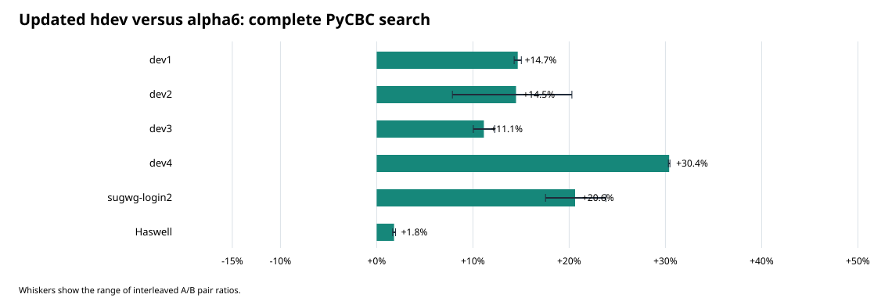
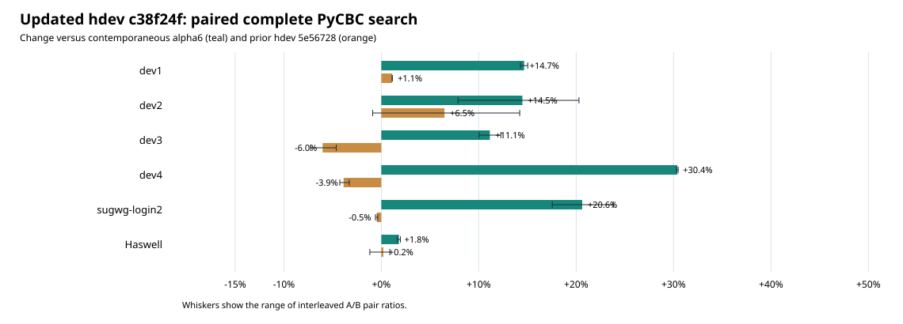

# `hdev` N=1024 attempt: PyCBC fleet benchmark, 2026-09-27

The attempted optimization at `c38f24f2b230ed7a5345f1aec3eb4e9097f57f02`
adds precomputed vector twiddles and a full-window peak-scan shortcut to
the AVX2 32×32 coarse kernel. It was measured against the previous `hdev`
head `5e56728785ea0f447edcf3a37a56f4d3263f4543` and alpha6.
The benchmarked commit had a correctness bug under `MF_ILAY=0`; it was
fixed and pushed to `hdev` as `33991f4` after the benchmark. The fix restores
the previous path for that nondefault layout; the default timed path is
unchanged. See [Correctness](#correctness) below.



| CPU host | Alpha6 k template-s/s | New `hdev` k template-s/s | Change vs alpha6 | Change vs `5e56728` |
|---|---:|---:|---:|---:|
| dev1 | 996.3 | 1142.4 | +14.7% | +1.1% |
| dev2 | 1152.8 | 1319.7 | +14.5% | +6.5% raw; late pairs flat |
| dev3 | 645.0 | 716.8 | +11.1% | **−6.0%** |
| dev4 | 962.8 | 1255.3 | +30.4% | **−3.9%** |
| sugwg-login2 | 479.1 | 577.8 | +20.6% | −0.5% |
| Haswell | 347.9 | 354.2 | +1.8% | +0.2% |

The important comparison for this attempt is against `5e56728`.
Four Haswell pairs give **353.0k old versus 353.7k new**, a +0.2% change;
a 31-round captured `run_series` comparison gives **0.988×** for the new
build (1.2% slower, six wins). There is no meaningful Haswell gain.
The dev3 and dev4 regressions survived reversed run order, with all four
pairs on each host favoring the prior build. Dev2 uses AVX3, outside the
new AVX2 specialization. Its first two A/B pairs appeared +11–14%, but
after reversing order both builds settled near 1.42 million and the next
two pair ratios were +0.8% and −0.9%. The raw four-pair mean is affected
by startup drift and should not be attributed to this kernel.



## Which path Haswell actually executes

The captured Haswell workload reports AVX2, coarse band 1024, and 64
templates. At band 1024 the AVX2 hierarchical selector's direct
pair-batch limit is 512, so it constructs the balanced plan. The N=1024
split is 32×32. A diagnostic build printed the following from a real
captured call on CPU3:

```text
[MF_PATH] stageA_prod_32 W=8 N1=32 N2=32 fuse=2 ilay=1 bblk=1 precomputed=1
[MF_PATH] binmax_fused32 W=8 ws=576 we=918 full_window=0 thr=4.61751
```

Later captured windows map to roughly 105–918. Thus the new precomputed
twiddles **are** used, but the new `ws==0 && we>=1024` scan shortcut **is
not** used by this PyCBC workload. The instrumented Haswell search spent
21.425 seconds in lower-stage work and 3.651 seconds in the upper stage
over steady segments; 20.886 seconds were inside the lower kernel. Its
native phase counters assign 89.1% of lower-kernel cycles to coarse work.
Coarse execution is the right broad target, but this commit optimizes a
full-window scan that the measured search does not take, while its
twiddle change has no demonstrated Haswell benefit.

## Correctness

All six complete alpha6/new searches produced the same 4,386 sorted
trigger identities. Maximum absolute SNR difference was `2.3842e-6`;
[validation.json](validation.json) records each host.

The unmodified `c38f24f` local suite reported **2 failed, 687 passed,
330 skipped**. Both failures are N=1024 full-correlation cases with
`MF_ILAY=0`: the specialized stage A assumed the unit-stride intermediate
and bypassed the required `eidx()` permutation. On the committed fix
`33991f4`, the 12 targeted geometry cases passed, followed by the full
suite: **689 passed, 330 skipped**. The fix restores the previous stage-A
path for `MF_ILAY=0` and non-AVX2 widths; it leaves the optimized default
`MF_ILAY=1` path intact. A separate 31-round captured Haswell A/B comparison
of unfixed versus fixed binaries gave **1.001×** for the fix (16/31 wins),
consistent with no default-path performance cost.

`results.json` holds every parsed run and stage time. `logs.tar.gz`
contains the raw paired logs, representative HDF outputs, the Haswell
profile, fixture measurement, diagnostic trace, and local test logs.
[RUNBOOK.md](RUNBOOK.md) records build identity, paths, and rerun commands.
