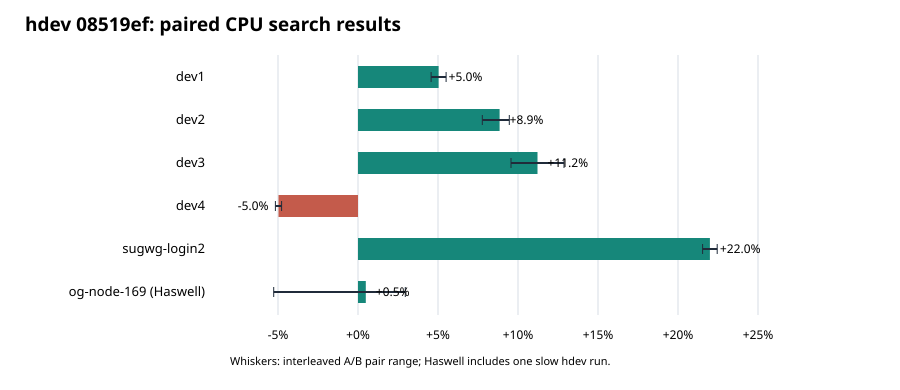
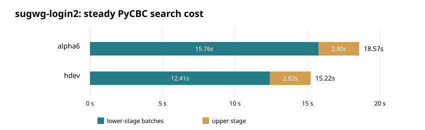

# `hdev` PyCBC fleet comparison, 2026-09-27

This is an agent handoff for the experimental `hdev` branch at
`08519ef211c426e5e2e1c69f336153933252ac26`, compared with alpha6/main
`2063306`. **Do not merge `hdev` on these results.** It misses the intended
large Haswell improvement and regresses dev4. The package version string is
`0.1.0a6` for both builds, so use the Git SHA and native module hashes in
[RUNBOOK.md](RUNBOOK.md) to identify them.

On sugwg-login2, the lower-stage batch rate rose from **561k** to
**713k template-seconds/s** (+27.1%). Complete-search throughput rose from
**477k** to **581k template-seconds/s** (+22.0%); the upper stage remained
about 2.81 seconds in both builds.

| CPU host | alpha6 k template-s/s | `hdev` k template-s/s | change | paired A/B range |
|---|---:|---:|---:|---:|
| dev1 | 989.8 | 1039.6 | +5.0% | +4.6 to +5.5% |
| dev2 | 1313.8 | 1430.0 | +8.9% | +7.8 to +9.5% |
| dev3 | 650.8 | 723.8 | +11.2% | +9.6 to +12.9% |
| dev4 | 964.1 | 916.2 | **-5.0%** | -5.2 to -4.8% |
| sugwg-login2 | 476.5 | 581.3 | +22.0% | +21.5 to +22.5% |
| og-node-169, Haswell | 351.4 | 353.1 | **+0.5%** | -5.3 to +3.0% |

The comparison uses the same five-segment, 5,883-template PyCBC FIR search,
with two or four interleaved clean A/B pairs per host. The rate denominator
is 8,848,032 template-seconds over steady segments 1–4. This is complete
search throughput, including lower and upper stages, not a kernel-only rate.
One Haswell `hdev` run was unusually slow; its other runs were about 2–3%
faster, still far short of a substantial Haswell gain. Use the paired clean
runs for conclusions; profiling instrumentation adds overhead.

## Interpretation and next work

The captured Haswell `run_series` fixture gives `hdev`/alpha6 **0.996x**
over 31 interleaved rounds. Forcing `MF_PBMAX=1024` gives **0.736x**; forcing
balanced execution (`MF_PBMAX=0`) gives **1.000x**. The PyCBC workload uses
band 1024, while final `hdev` selects direct pair batching on AVX2 only
through band 512. Raising the cutoff would be a severe regression on this
Haswell fixture, not a route to the desired speedup. See the three
`fixture-*.json` files in the log archive.

On dev4, commit `6b65a1e` measured about **988k** template-s/s versus
contemporaneous alpha6 **963k**. The pre-last `hdev` commit `4056ae8`
measured **862k**, and final `08519ef` about **915k** in the same follow-up
session. Final `hdev` with `MF_PBMAX=1024` was only **873k** in two more runs.
Thus the last register-accumulator change recovers about 6%, and the final
512 cutoff is beneficial relative to forcing 1024 on dev4. The loss enters
after `6b65a1e`; `5993f31` (AVX2 `fft32_tw`) is the leading candidate,
but the runs do not prove a single source-line cause. Isolate that codelet
change on the final branch before deciding whether to retain it or specialize
its selection by measured hardware behavior.

The Haswell target needs a different optimization. `docs/coarse-kernel-plan-haswell.md`
discusses narrow coarse kernels; that work is not implemented in `hdev`.
Measure a candidate on the captured fixture *and* the full PyCBC search,
then repeat the six-host A/B check to protect the gains elsewhere.

## Correctness and reproducibility

All complete searches yielded 4,386 triggers. Per-host profile HDF files
have exactly the same sorted template hashes and end times as alpha6;
maximum SNR difference is `2.3842e-6` (dev1 `1.9074e-6`). The corrected
dev2 source launcher was used for the comparison. The isolated local `hdev`
build passed the full suite: **691 passed, 328 skipped**. CPU/GPU suite
skips reflect unavailable devices/optional environments, not failing tests.

`results.json` contains parsed per-run timing components and paired rates;
`analyze.py` rebuilds it and this SVG from the preserved logs. The archive
contains clean and instrumented logs, dev4 ablations, and Haswell fixture
diagnostics. The previous alpha6 fleet handoff remains in the adjacent
`pycbc-alpha6-fleet-20260927` directory.
