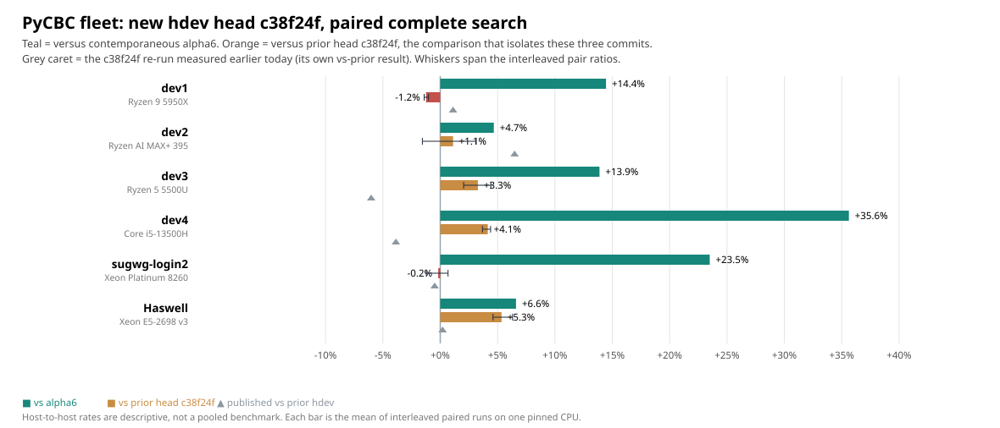

# `main` at `ce9c828`: PyCBC fleet benchmark, 2026-09-27

Current `main` (`ce9c828`, "Restructure v_transpose_store into two phases to
lower peak register pressure") measured against the previously documented head
`c38f24f` and against the released alpha6. This supersedes
[`pycbc-hdev-c38f24f-fleet-20260927`](../pycbc-hdev-c38f24f-fleet-20260927/README.md),
whose candidate regressed two hosts.



| CPU host | CPU | Alpha6 k template-s/s | `ce9c828` k template-s/s | vs alpha6 | vs `c38f24f` |
|---|---|---:|---:|---:|---:|
| dev1 | Ryzen 9 5950X | 993.2 | 1136.7 | +14.4% | −1.2% |
| dev2 | Ryzen AI MAX+ 395 | 1355.2 | 1418.4 | +4.7% | +1.1% |
| dev3 | Ryzen 5 5500U | 643.8 | 733.2 | +13.9% | +3.3% |
| dev4 | Core i5-13500H | 960.0 | 1302.0 | +35.6% | +4.1% |
| sugwg-login2 | Xeon Platinum 8260 | 459.6 | 567.6 | +23.5% | −0.2% |
| Haswell | Xeon E5-2698 v3 | 346.0 | 368.9 | +6.6% | **+5.3%** |

The comparison that isolates the five commits since `c38f24f` is the last
column. Four hosts gain, sugwg-login2 is flat, and dev1 loses 1.2%.

**Haswell gains 5.3%, the first real gain there in this line of work.** The
two preceding candidates measured +0.2% and +0.1% on that host. Its three
paired ratios span 1.046–1.063, tighter than the host's own drift, and the
absolute rate moves 346.0k → 368.9k. Haswell is the oldest and most
register-starved target in the fleet (16 YMM, FP add on port 1 only), which is
what `2891490`/`ce9c828` address: removing `stageA_prod_32` stack spills and
then restructuring the transpose store to lower peak register pressure.

dev1's −1.2% is consistent across all three pairs (0.986–0.990), so it is a
small real loss rather than noise, on the host with the most registers and the
least to gain from spill removal. It is the one result here arguing for a
target-conditional gate.

## Contamination and what was excluded

dev1's first attempt at this measurement was discarded: a teaser-workload run
pinned to the same CPU 0 overlapped it. It was re-run alone and only the
re-run is archived here.

Haswell is a shared node. During an earlier session that day its pinned core
was time-shared and rates halved to ~172k; for this run the node was quiet
(24.4–27.6 s per search, 352–362k) and the numbers are directly comparable to
the published quiet-node values. `analyze.py` drops any A/B pair in which one
run differs from the median of its own variant by more than 25%, which is how
a mid-run load change is excluded. Filtering on the A/B *ratio* instead would
discard genuine large speedups, so it is deliberately not done that way.

## Correctness

**Not established for this revision.** The workflow for the earlier candidates
verified 4,386 identical sorted trigger identities per host plus the package
test suite before interpreting a speedup, and `c38f24f` did ship two
`MF_ILAY=0` failures that only the suite caught. The five commits here touch
codelet generation, Stage B gating, x86 build flags and the SIMD transpose
store. Treat these as timing measurements only, pending that check.

## Reproduction

`logs.tar.gz` holds every paired log. The folder is self-reproducing:

```bash
folder=docs/measurements/pycbc-main-ce9c828-fleet-20260927
mkdir -p /tmp/mf-main-logs && tar -xzf "$folder/logs.tar.gz" -C /tmp/mf-main-logs
python "$folder/analyze.py" /tmp/mf-main-logs /tmp/mf-main-out \
  "$folder/baseline-c38f24f-results.json"
diff "$folder/results.json" /tmp/mf-main-out/results.json
diff "$folder/chart.svg"    /tmp/mf-main-out/chart.svg
```

Both diffs are empty. `run-paired.sh` is the driver; its arguments are
`base out alpha_target old_target new_target cpu pycbc_source venv
source_first rounds [extra_ld]`. It runs alpha6-vs-new and old-vs-new, each
two interleaved pairs, then appends one reverse-order pair (B before A) so an
order effect is visible. Host paths, CPU pins and the FFTW `LD_LIBRARY_PATH`
requirement are unchanged from
[the previous runbook](../pycbc-hdev-c38f24f-fleet-20260927/RUNBOOK.md).

### Building the candidate

No fleet host has Python headers for its own venv interpreter, and the venvs
carry a setuptools too old for `project.license = "MIT"`. Build with isolation
ON, plus `CPATH` pointing at headers taken from elsewhere on the host:

```bash
export CPATH=$(ls -d ~/miniconda3/pkgs/python-3.13*/include/python3.13 | head -1)  # dev1
export CPATH=~/miniforge3/envs/ecc_search_dev/include/python3.11                   # sugwg-login2
pip wheel --no-deps -w wheel .
```

Two wheels cover the fleet: **cp313** for dev1–dev4, **cp311** for
sugwg-login2 and Haswell. Verify each host imports the intended binary before
timing — hash `_core*.so` through the target's `PYTHONPATH`. This run measured
`_core` `3413700…` (cp313) and `615d6a4…` (cp311); an earlier install silently
left two hosts on a stale binary and was caught only by that hash.
