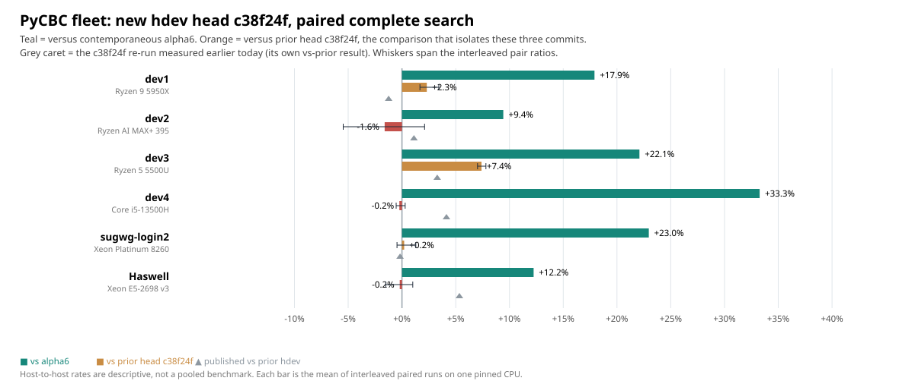

# `main` at `eecb43c`: PyCBC fleet benchmark, 2026-09-28

Current `main` (`eecb43c`, twenty-five optimization passes plus
architecture-specific CPU cost tables and `run_series` batch planning)
measured against the previously documented head `ce9c828` and the released
alpha6. Supersedes
[`pycbc-main-ce9c828-fleet-20260927`](../pycbc-main-ce9c828-fleet-20260927/README.md).



| CPU host | CPU | Alpha6 k template-s/s | `eecb43c` k template-s/s | vs alpha6 | vs `ce9c828` |
|---|---|---:|---:|---:|---:|
| dev1 | Ryzen 9 5950X | 984.1 | 1160.3 | +17.9% | +2.3% |
| dev2 † | Ryzen AI MAX+ 395 | 581.9 | 636.8 | +9.4% | −1.6% |
| dev3 | Ryzen 5 5500U | 643.0 | 785.1 | +22.1% | **+7.4%** |
| dev4 | Core i5-13500H | 938.8 | 1251.1 | +33.3% | −0.2% |
| sugwg-login2 | Xeon Platinum 8260 | 455.2 | 559.7 | +23.0% | +0.2% |
| Haswell | Xeon E5-2698 v3 | 332.3 | 373.0 | +12.2% | −0.2% |

† dev2 ran under heavy unrelated load; see below.

The column that isolates the twenty-five passes is the last one. **dev3 gains
7.4%**, with its three paired ratios spanning 1.070–1.078 — tighter than the
host's own drift, so the gain is real. dev1 gains 2.3% (1.017–1.034). dev4,
sugwg-login2 and Haswell are flat within their pair ranges.

That distribution is worth noting: the largest gain lands on the **Ryzen 5
5500U**, the smallest and most cache-constrained machine in the fleet, while
the wide-issue hosts see little. Passes that cut instruction count and memory
traffic help most where there is least of both.

Haswell did not repeat the +5.3% it showed for `ce9c828`; it is now flat
against that head, which is consistent — that gain was banked in the previous
revision, not lost here. Against alpha6 it is +12.2%, up from +6.6%.

## Contamination

**† dev2 is not a usable measurement of that hardware.** An unrelated
workload held the host at load 38 on 32 cores throughout. Its absolute rate
reads 636.8k against 1418.4k measured on the same machine the day before —
about 2.2× slow — and its pair range is a loose 0.945–1.021 against 0.995–1.013
or tighter elsewhere. Its A/B ratio is the least damaged number there, since
interleaved pairs cancel steady load, but the absolute rates describe a loaded
machine.

Every other host was checked before measuring: dev1 0.07, dev3 0.02, dev4 0.04
and sugwg-login2 0.35 were idle; Haswell is a shared node at its usual load.

`analyze.py` drops any A/B pair in which one run differs from the median of
its own variant by more than 25%, which excludes a mid-run load change.
Filtering on the A/B *ratio* instead would discard genuine large speedups, so
it deliberately does not.

## Correctness

**Not established for this revision.** These are timing measurements only.
Twenty-five passes touching codelet dispatch, native ingestion, GPU barriers
and peak packing warrant the trigger-identity check and the package test suite
before any of this is used to justify a merge.

## Reproduction

The folder is self-reproducing from `logs.tar.gz`:

```bash
folder=docs/measurements/pycbc-main-eecb43c-fleet-20260928
mkdir -p /tmp/mf-logs && tar -xzf "$folder/logs.tar.gz" -C /tmp/mf-logs
python "$folder/analyze.py" /tmp/mf-logs /tmp/mf-out \
  "$folder/baseline-ce9c828-results.json"
diff "$folder/results.json" /tmp/mf-out/results.json
diff "$folder/chart.svg"    /tmp/mf-out/chart.svg
```

Both diffs are empty. Build and host details are unchanged from
[the previous page](../pycbc-main-ce9c828-fleet-20260927/README.md): build with
isolation on plus `CPATH`, two wheels (cp313 for dev1–dev4, cp311 for
sugwg-login2 and Haswell), and verify each host imports the intended binary by
hashing `_core*.so` through its `PYTHONPATH` before timing. This run measured
`d57a1e7…` (cp313) and `f083c62…` (cp311).
