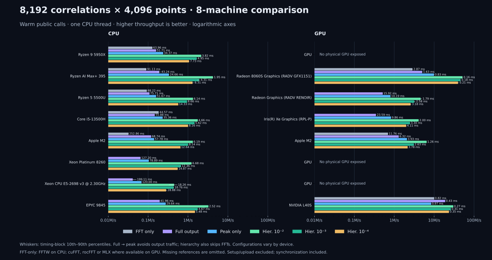

# Six-machine teaser comparison

Measured September 27, 2026, at library revision `ce9c828` (current `main`).
This recalculates [the September 26 comparison](teaser-fleet-20260926.md),
which was taken at revision `fe7371d`; that page is kept for history.
All timing blocks are preserved in the recorded JSON.



[Machine-readable results](teaser-fleet-20260927.json) include hardware,
backend, software versions, CPU affinity, load averages, correctness checks,
every timing block, automatic hierarchical configurations, and refinement
fractions. Bars show median throughput; whiskers show the timing-block
10th–90th percentiles, not statistical confidence intervals.

## Workload and timing

Unchanged from the previous comparison: each call processes **16 data spectra
× 512 templates × 4096 points** with the same Gaussian noise and
matched-profile bank, a full lag window, and SNR threshold 5.5. These are warm
public `run()` calls, not `run_series()` or isolated kernel times. CPU calls
use one thread. Linux processes are pinned to CPU 0, except gravity-dev2 uses
CPU 2; macOS schedules its thread. Setup, calibration, template preparation,
and input upload are excluded. Full correlation reuses output storage; GPU
calls include synchronization. After 0.5 s of warmup each mode records nine
blocks of at least 50 ms, and the reported median uses all collected blocks.

## CPU timings

Milliseconds per batch; smaller is faster.

| CPU | FFTW | Full | Peak | Hier. 0.01 | Hier. 0.001 | Hier. 0.0001 |
|---|---:|---:|---:|---:|---:|---:|
| Ryzen 9 5950X | 64.01 | 51.92 | 36.74 | 3.31 | 4.18 | 6.96 |
| Ryzen AI Max+ 395 † | 118.61 | 59.08 | 26.33 | 2.14 | 3.85 | 10.12 |
| Ryzen 5 5500U | 87.51 | 74.99 | 52.73 | 4.94 | 6.50 | 12.06 |
| Core i5-13500H | 44.73 | 55.96 | 36.67 | 4.03 | 4.94 | 6.00 |
| Apple M2 | 252.33 | 68.90 | 60.52 | 5.39 | 6.68 | 14.32 |
| Xeon Platinum 8260 (VM) ‡ | 220.27 | 142.45 | 76.05 | 5.13 | 6.89 | 11.53 |

## GPU timings

| GPU | FFT only | Full | Peak | Hier. 0.01 | Hier. 0.001 | Hier. 0.0001 |
|---|---:|---:|---:|---:|---:|---:|
| Radeon 8060S (RADV GFX1151) † | 2.82 | 1.82 | 1.00 | 0.23 | 0.25 | 0.29 |
| Radeon integrated, 5500U | unavailable | 15.99 | 10.17 | 1.93 | 2.15 | 1.71 |
| Iris Xe, Core i5-13500H | unavailable | 23.87 | 9.69 | 5.35 | 5.56 | 25.38 |
| M2, 10 GPU cores | 11.74 | 6.31 | 3.93 | 0.86 | 1.37 | 2.31 |

The Ryzen 9 5950X and the Xeon guest expose no physical GPU; software
rendering is excluded. rocFFT is unavailable on gravity-dev3, and no FFT-only
reference is available on Iris Xe. Those gaps are the same as on September 26.

## What changed since `fe7371d`

The fixed references are the control. FFTW and rocFFT do not contain
matchedfilter code, so where a baseline holds steady the comparison is sound,
and where it moves the host moved. On the four uncontended machines the
baselines reproduce to within 0.8%:

    FFTW change      5950X -0.2%   5500U +0.7%   i5-13500H -0.8%   M2 -0.1%
    GPU FFT change                                                 M2 -0.2%

Against that control, the real change is concentrated in **hierarchical mode
at tight false-dismissal budgets**:

    Hier. 1e-4 CPU   5950X +14.8%   5500U +28.9%   i5-13500H +37.9%
    Hier. 1e-2 CPU   M2 +29.0%      Hier. 1e-3 CPU  M2 +23.6%
    Hier. 1e-2 GPU   Iris Xe +19.3%

Full output and peak-only are flat to slightly slower on CPU (−0.7% to −1.8%
on the three clean Linux hosts, +0.4%/+0.5% on M2). The work since `fe7371d`
targeted the hierarchical coarse stage, and that is where it shows; the
non-hierarchical paths are unchanged within measurement noise.

Two rows carry qualifications, and neither is a property of this revision:

**† gravity-dev2 was contended.** An unrelated eight-process workload
saturated the host during its run. Its FFTW baseline came in **34% slower**
than September 26 and rocFFT 7.1% slower, which is proof the machine moved
rather than the code: the memory-heavy modes degrade most (full output −38%,
FFTW −34%) while compute-bound peak-only loses only 6%. A repeat run
reproduced the same shifted values. Its absolute numbers are valid for a
loaded host and must not be compared against the other rows as hardware.

**‡ sugwg-login2 is a virtualized guest** whose FFTW baseline moved 32%
between the two dates. Its matchedfilter columns moved in the opposite
direction (peak +4.3%, hierarchy +6–9%), so the guest's own timing stability
bounds what can be read from that row.

## Interpretation

- Hierarchical screening at `fd=1e-4` is now the mode that improved most on
  CPU, by 15–38% on uncontended hosts. That budget previously selected a
  costlier band configuration than it needed.

- Iris Xe hierarchy remains a performance target rather than a result: its
  `fd=1e-4` configuration takes 25.38 ms against 9.69 ms for flat peaks, worse
  than the 23.05/9.73 ms recorded on September 26. The Intel accuracy and
  dispatch corrections described in the September 26 page still apply; this
  revision does not claim Intel GPU tuning.

- These bars compare complete algorithms, not equal work. FFTW and the GPU
  FFT-only references time only the inverse transform. The
  [work and traffic accounting](m2-teaser-headroom.md) explains why peak-only
  output can beat a memory-heavy full transform and why a hierarchy should not
  be credited with FLOPs it avoided. This measurement checks numerical
  correctness, including a strong injected match, but does not remeasure
  statistical false-dismissal rates per device.

## Reproduction

Install the same source revision into a project-local environment and run CPU
and GPU separately, so a GPU capability or correctness failure cannot discard
CPU results:

```bash
python tools/teaser_fleet.py --device cpu --cpu 0 --revision ce9c828 --out cpu.json
python tools/teaser_fleet.py --device gpu --cpu 0 --revision ce9c828 --out gpu.json
```

Omit `--cpu` on macOS; use `--cpu 2` on gravity-dev2. Use `--reps 21` for a
longer measurement. A host with no hardware GPU produces an explicit empty
report; a correctness failure records the reason and exits unsuccessfully.
`pyfftw`, `pytest` and `matplotlib` must be present or the FFTW baseline and
the validation step are silently skipped — a missing `pyfftw` is why one
first-pass run here recorded five rows instead of six. To redraw the combined
chart from the recorded reports:

```bash
python tools/teaser_fleet.py --compare docs/measurements/teaser-fleet-20260927.json \
  --out docs/assets/teaser-fleet.svg
```

Do not run a teaser measurement and another pinned benchmark on the same CPU
concurrently: an earlier attempt here overlapped a teaser run with a PyCBC
search on CPU 0 and both had to be discarded.

The source/runtime, dependencies, caches, temporary files, and results were
kept in dedicated benchmark folders, reusing the existing project on M2. No
global package installation or system tuning was performed.
