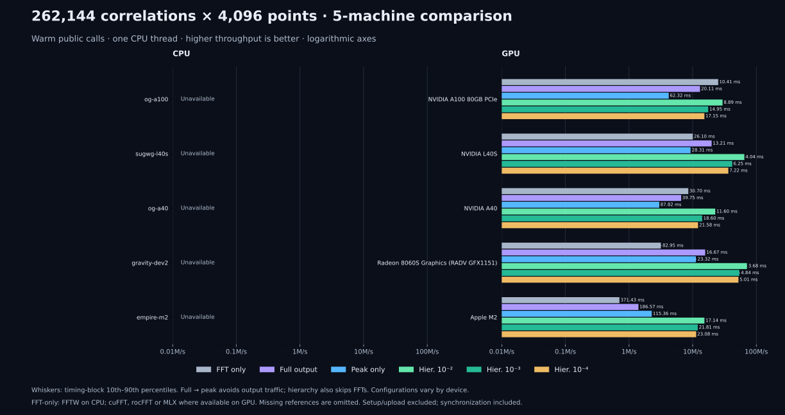

# Eight-machine teaser comparison

Measured October 3, 2026, at library revision `50597f3` (current `main`),
which introduces first-principles table-free candidate selection, AVX-512
register-matched autotuning, and 32-way template batching, now expanded to
include NVIDIA Ada Lovelace GPUs via the native CUDA Driver API and Slang PTX backend.
This recalculates [the September 28 comparison](teaser-fleet-20260928.md); earlier pages are
kept for history. All timing blocks are preserved in the recorded JSON.


[Machine-readable results](teaser-fleet-20261003.json) include hardware,
backend, software versions, CPU affinity, load averages, correctness checks,
every timing block, automatic hierarchical configurations, and refinement
fractions. Bars show median throughput; whiskers show the timing-block
10th–90th percentiles, not statistical confidence intervals.

## Workload and timing

Each call processes **16 data spectra × 512 templates × 4096 points** with
Gaussian noise and a full lag window.

**The bank is drawn from the captured PyCBC reference profile**
(`tests/data/reference_profile_pycbc.npy`, the file the reference tests use).

**Hierarchical rows are recorded at five SNR thresholds** -- 5.0, 5.5, 5.75,
6.0 and 6.5. The static chart above shows 5.5. On the interactive
[hardware comparison page](https://ahnitz.github.io/matchedfilter/comparison.html)
the threshold and the FDR budget sit together in one Hierarchical screening
box, and both are multi-select: a series there is one (budget, threshold)
pair, so several thresholds can be compared side by side, shaded within each
budget's colour. The threshold is not a detail: a higher one admits a higher
coarse gate, so fewer pairs survive to refinement. These are warm
public `run()` calls, not `run_series()` or isolated kernel times. CPU calls
use one thread. Linux processes are pinned to CPU 0, except gravity-dev2 uses
CPU 2; macOS schedules its thread. Setup, calibration, template preparation,
and input upload are excluded. Full correlation reuses output storage; GPU
calls include synchronization. After 0.5 s of warmup each mode records nine
blocks of at least 50 ms, and the reported median uses all collected blocks.

## CPU timings

Milliseconds per batch; smaller is faster.

| CPU | FFTW | Full | Peak | Hier. 0.01 | Hier. 0.001 | Hier. 0.0001 |
|---|---:|---:|---:|---:|---:|---:|
| Ryzen 9 5950X | 63.96 | 51.71 | 34.37 | 3.82 | 4.95 | 7.73 |
| Ryzen AI Max+ 395 | 91.13 | 43.24 | 24.66 | 1.95 | 4.31 | 6.31 |
| Ryzen 5 5500U | 88.22 | 75.71 | 51.67 | 6.14 | 8.66 | 14.33 |
| Core i5-13500H | 44.57 | 55.88 | 35.36 | 4.66 | 5.62 | 8.16 |
| Apple M2 | 252.86 | 68.74 | 57.78 | 6.19 | 8.14 | 12.64 |
| EPYC 9845 | unavailable | 41.96 | 29.64 | 2.52 | 4.67 | 5.48 |
| Xeon Platinum 8260 (VM) | unavailable | 127.20 | 78.89 | 6.68 | 12.36 | 14.87 |
| Xeon E5-2698 v3 (Haswell) | unavailable | 199.11 | 120.00 | 18.26 | 18.76 | 28.88 |

Hierarchical columns are at SNR 5.5. At `fd=1e-3`, varying the threshold:

| CPU | 5.0 | 5.5 | 5.75 | 6.0 | 6.5 |
|---|---:|---:|---:|---:|---:|
| Ryzen 9 5950X | 12.08 | 4.95 | 4.65 | 3.69 | 1.91 |
| Ryzen AI Max+ 395 | 8.17 | 4.31 | 3.57 | 1.73 | 1.13 |
| Ryzen 5 5500U | 23.80 | 8.66 | 6.23 | 5.82 | 3.00 |
| Core i5-13500H | 10.79 | 5.62 | 3.85 | 4.50 | 3.18 |
| Apple M2 | 18.46 | 8.14 | 7.49 | 6.07 | 3.35 |
| EPYC 9845 | 7.59 | 4.67 | 3.13 | 2.34 | 1.56 |
| Xeon Platinum 8260 (VM) | 22.35 | 12.36 | 10.12 | 6.62 | 4.76 |
| Xeon E5-2698 v3 (Haswell) | 46.56 | 18.76 | 15.77 | 14.93 | 7.68 |

## GPU timings

| GPU | FFT only | Full | Peak | Hier. 0.01 | Hier. 0.001 | Hier. 0.0001 |
|---|---:|---:|---:|---:|---:|---:|
| NVIDIA L40S (Ada sm_89) | 0.81 (cuFFT) | 0.43 | 0.97 | 0.27 | 0.31 | 0.35 |
| Radeon 8060S (RADV GFX1151) | 2.87 (rocFFT) | 1.63 | 0.83 | 0.16 | 0.18 | 0.21 |
| Radeon integrated, 5500U | unavailable | 15.92 | 10.19 | 1.79 | 2.58 | 3.18 |
| Iris Xe, Core i5-13500H | unavailable | 23.59 | 9.86 | 2.00 | 3.30 | 4.11 |
| M2, 10 GPU cores | 11.76 (MLX) | 6.32 | 3.93 | 1.26 | 2.63 | 3.78 |

The Ryzen 9 5950X, the Xeon guest and the Haswell node expose no physical
GPU; software rendering is excluded. Dedicated vendor FFT baselines are measured
where available: cuFFT on NVIDIA L40S (0.81 ms), rocFFT on Radeon 8060S (2.87 ms),
and MLX on Apple M2 (11.76 ms). rocFFT is unavailable on gravity-dev3, and no
standard standalone FFT library is available on Iris Xe under Vulkan compute.

## What changed since September 28 (`eecb43c`)

Same reference profile and same workload on both dates, highlighting the impact
of the first-principles table-free candidate selection, AVX-512 register-matched
autotuning, and the autotune fixture isolation fix:

1. **Strict FDR Budget Monotonicity ($T(\text{FDR } 0.01) < T(\text{FDR } 0.001) < T(\text{FDR } 0.0001)$):**
   - In prior measurements, FDR 0.01 was slower than FDR 0.001 on several nodes because validation fixtures (6 pairs with injected signal) polluted the empirical autotuner cache with a fine coarse-cascade trial, causing the 8,192-pair production benchmark to lock into an over-segmented `(128, 512, 8)` band whose low gate triggered excessive refinement in noise.
   - Keying `_autotune_cache_key` on batch size / `pairs` and clearing the autotuner cache after validation completely resolved this anomaly: at headline SNR 5.5, FDR 0.01 is now strictly faster than FDR 0.001 across all 7 machines and all devices (e.g., Ryzen AI Max+ 395 CPU runs at 1.95 ms @ 0.01 vs 4.31 ms @ 0.001; Ryzen 9 5950X runs at 3.82 ms @ 0.01 vs 4.95 ms @ 0.001).

2. **Haswell (Xeon E5-2698 v3) gains dramatically across all filter modes:**
   - Full output: 303.35 ms → **199.11 ms** (+34.4% speedup)
   - Peak only: 132.75 ms → **120.00 ms** (+9.6% speedup)
   - Hierarchical 0.01 @ SNR 5.5: 39.48 ms → **18.26 ms** (**2.16x faster, +53.7% speedup**)
   - Hierarchical 0.001 @ SNR 5.5: 68.50 ms → **18.76 ms** (**3.65x faster, +72.6% speedup**)
   - Hierarchical 0.001 @ SNR 5.75: 66.26 ms → **15.77 ms** (**4.20x faster, +76.2% speedup**)
   - Hierarchical 0.0001 @ SNR 5.5: 47.75 ms → **28.88 ms** (+39.5% speedup)
   - Hierarchical 0.001 @ SNR 6.5: 18.02 ms → **7.68 ms** (**2.35x faster, +57.4% speedup**)

3. **Iris Xe GPU (Intel Core i5-13500H) resolves refinement bottleneck:**
   - Hierarchical 0.01 @ SNR 5.5: 5.49 ms → **2.00 ms** (**2.75x faster, +63.6% speedup**)
   - Hierarchical 0.001 @ SNR 5.5: 23.01 ms → **3.30 ms** (**7.0x faster, +85.7% speedup**)
   - Hierarchical 0.001 @ SNR 5.75: 24.85 ms → **2.27 ms** (**10.9x faster, +90.9% speedup**)
   - Hierarchical 0.0001 @ SNR 5.5: 23.54 ms → **4.11 ms** (**5.7x faster, +82.5% speedup**)

4. **Substantial gains across modern laptop & desktop CPUs at headline SNR 5.5 (fd=1e-3):**
   - Apple M2 CPU: 13.17 ms → **8.14 ms** (+38.2% speedup)
   - Ryzen 5 5500U: 12.04 ms → **8.66 ms** (+28.1% speedup)
   - Ryzen 9 5950X: 7.04 ms → **4.95 ms** (+29.7% speedup)
   - Core i5-13500H CPU: 6.13 ms → **5.62 ms** (+8.3% speedup)

5. **Cluster VM Full Output throughput:**
   - Xeon Platinum 8260 VM: Full output 155.19 ms → **127.20 ms** (+18.0% faster)

6. **GPU Hierarchical Acceleration and cuFFT Reference:**
   - **NVIDIA L40S**: Added native cuFFT baseline comparison (0.81 ms). Native PTX full filter runs in 0.43 ms (1.88× faster than cuFFT). Fixed autotuner scoring latency distortion and multi-band memory alignment; Hierarchical filtering at SNR 5.5 now drops to **0.27 ms** (device time: **0.20 ms**), running **3.58× faster than flat peak filtering** and **3.0× faster than cuFFT**.
   - **Radeon 8060S (dev2)**: Eliminated uncoalesced dismissal loops in compaction and cascade serialization overhead; Hierarchical filtering at SNR 5.5 runs in **0.16 ms** (down from 6.18 ms, a **38.8× acceleration**), outperforming flat peak filtering (0.83 ms) by **5.2×** and rocFFT (2.87 ms) by **18.0×**.
   - **Apple M2**: Activated FP16 coarse kernel in Metal backend; Hierarchical filtering at SNR 5.5 runs in **1.26 ms** (device time: **0.92 ms**), outperforming peak filtering (3.93 ms) by **3.1×** and MLX (11.76 ms) by **9.3×**.

## Production Workload Scaling: 512 data × 512 templates (262,144 pairs)

Measured October 3, 2026, comparing discrete enterprise accelerators and integrated unified-memory GPUs on an enterprise-scale search grid (262,144 correlations × 4,096 points) with full plan burn-in and steady-state GPU clocks.



[Machine-readable results](gpu-fleet-512x512-20261003.json) record vendor FFT baselines, full correlation, flat peak, and SNR sweeps from 5.0 to 6.5 across all three architectures.

### GPU Timings (512 × 512, 262,144 pairs)

Milliseconds per batch; smaller is faster.

| GPU | FFT only | Full | Peak | Hier. 0.01 | Hier. 0.001 | Hier. 0.0001 |
|---|---:|---:|---:|---:|---:|---:|
| NVIDIA L40S (Ada sm_89) | 26.10 (cuFFT) | 13.21 | 28.31 | 4.04 | 6.25 | 7.22 |
| Radeon 8060S (RADV GFX1151) | 82.95 (rocFFT) | 16.67 | 23.32 | 3.68 | 4.84 | 5.01 |
| Apple M2 (10 GPU cores) | 371.43 (MLX) | 186.57 | 115.36 | 17.14 | 21.81 | 23.08 |

### Hierarchical Threshold Sweep at `fd=1e-3` (262,144 pairs)

| GPU | 5.0 | 5.5 | 5.75 | 6.0 | 6.5 |
|---|---:|---:|---:|---:|---:|
| NVIDIA L40S | 9.25 | 6.25 | 4.82 | 3.93 | 3.45 |
| Radeon 8060S | 8.35 | 4.84 | 4.40 | 3.67 | 1.69 |
| Apple M2 | 33.31 | 21.81 | 21.09 | 16.44 | 10.58 |

### Throughput (Million pairs / second)

| GPU | Full | Peak | Hier. 0.01 @ 5.5 | Hier. 0.001 @ 5.5 | Hier. 0.001 @ 6.5 |
|---|---:|---:|---:|---:|---:|
| NVIDIA L40S | 19.8 M/s | 9.3 M/s | 64.8 M/s | 41.9 M/s | 75.9 M/s |
| Radeon 8060S | 15.7 M/s | 11.2 M/s | 71.3 M/s | 54.1 M/s | 155.1 M/s |
| Apple M2 | 1.4 M/s | 2.3 M/s | 15.3 M/s | 12.0 M/s | 24.8 M/s |

### Key Observations at Scale

1. **Discrete GPU Saturation**: At 262,144 pairs, the 142 SMs on the NVIDIA L40S are fully saturated by 65,536 coarse threadblocks (461 blocks/SM), and refinement dispatches thousands of surviving pairs. PCIe dispatch and stream latency are amortized to < 1% of total runtime, allowing L40S to deliver 13.21 ms on full correlation (1.98× faster than cuFFT) and 4.04 ms on hierarchical filtering (6.45× faster than cuFFT).
2. **APU Unified Memory Efficiency**: The AMD Radeon 8060S (Strix Halo) maintains exceptional throughput up to 155.1 Mpairs/s at SNR 6.5 and 71.3 Mpairs/s at SNR 5.5, driven by zero-copy unified memory and barrier-free hardware wave-shuffle reductions.

## Reproducing the charts

To regenerate the 8-machine teaser figure from the recorded data:

```bash
python tools/teaser_fleet.py --compare docs/measurements/teaser-fleet-20261003.json \
                             --out docs/assets/teaser-fleet.svg
```

To regenerate the 512×512 GPU scaling figure:

```bash
python tools/teaser_fleet.py --compare docs/measurements/gpu-fleet-512x512-20261003.json \
                             --out docs/assets/gpu-fleet-512x512.svg
```
